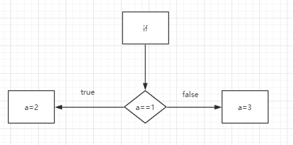

- [SIJ](#SIJ)
  - [1. SIJ是什么？](#1-SIJ%E6%98%AF%E4%BB%80%E4%B9%88)
  - [2. 我是怎么实现的？](#2-%E6%88%91%E6%98%AF%E6%80%8E%E4%B9%88%E5%AE%9E%E7%8E%B0%E7%9A%84)
    - [2.1 词法分析器(Lexer) : 使用Lexer解析代码得到连串的Token](#21-%E8%AF%8D%E6%B3%95%E5%88%86%E6%9E%90%E5%99%A8Lexer--%E4%BD%BF%E7%94%A8Lexer%E8%A7%A3%E6%9E%90%E4%BB%A3%E7%A0%81%E5%BE%97%E5%88%B0%E8%BF%9E%E4%B8%B2%E7%9A%84Token)
      - [2.1.1 怎么实现一个Lexer](#211-%E6%80%8E%E4%B9%88%E5%AE%9E%E7%8E%B0%E4%B8%80%E4%B8%AALexer)
    - [2.2 语法分析器: 从Lexer接受Token序列，分析出语法树](#22-%E8%AF%AD%E6%B3%95%E5%88%86%E6%9E%90%E5%99%A8-%E4%BB%8ELexer%E6%8E%A5%E5%8F%97Token%E5%BA%8F%E5%88%97%E5%88%86%E6%9E%90%E5%87%BA%E8%AF%AD%E6%B3%95%E6%A0%91)
      - [2.2.1 分析方法](#221-%E5%88%86%E6%9E%90%E6%96%B9%E6%B3%95)
      - [2.2.2 语法树](#222-%E8%AF%AD%E6%B3%95%E6%A0%91)
    - [2.3 "运行"语法树](#23-%22%E8%BF%90%E8%A1%8C%22%E8%AF%AD%E6%B3%95%E6%A0%91)
  - [4.我该怎么运行?](#4%E6%88%91%E8%AF%A5%E6%80%8E%E4%B9%88%E8%BF%90%E8%A1%8C)
    - [4.1 通过Jar包](#41-%E9%80%9A%E8%BF%87Jar%E5%8C%85)
    - [4.2 编译代码](#42-%E7%BC%96%E8%AF%91%E4%BB%A3%E7%A0%81)
  - [5. 运行截图](#5-%E8%BF%90%E8%A1%8C%E6%88%AA%E5%9B%BE)
# SIJ
## 1. SIJ是什么？
一个用Java实现的、简单明了的解释器  
SIJ是Simple Interpreter implemented by Java(缩写)
特点
- 实现简单明了
- 语法树可视化 -> debug简单明了
- 编译、运行错误下户线下划线提示 -> debug简单明了
- 模块化 -> 看起来简单明了

## 2. 我是怎么实现的？
通过例子看看SIJ的实现原理
假设我们有代码
```C++
if( a == 1){
    a = 2;
}
else{
    a = 3;
}
```
### 2.1 词法分析器(Lexer) : 使用Lexer解析代码得到连串的Token
Token就是代码中的基本单位,Lexer作用就是把一段代码切成有序的Token序列  
上述的代码会被切成序列
> 'if', '(',  'a', '==', '1', ')', '{', 'a', '=', '2', '}', 'else', '{', 'a', '=', '3', '}'


通过例子发现Lexer做了:
- 忽略空格、换行符(\n)、制表符(\t)
- 精准切割出最小基本单元: '=='号不会被切为两个'=',方便后面精准识别

#### 2.1.1 怎么实现一个Lexer
借助正则表达式实现一个Lexer非常简单,也容易修改
具体实现请看代码[src/com/compilerExp/component/](https://github.com/cyy5358/SIJ/blob/master/src/com/compilerExp/component/RecursiveDescent.java)

|Token类型|正则表达式|
|-|-|
|IdentifierToken|".*?([a-zA-Z_]+).*?"|
|AssignOpToken|".*?(=).*?"|
|SplitOpToken|".*?(;).*?"|
|ParanToken|".*?([\\(\\)\\[\\]\\{\\}]).*?"|
|LogOpToken|".*?(>=|<=|==|>|<|!=|\\|\\||&&|\\!).*?"|
|ArOpToken|".*?([+\\-\\*/]).*?"|
|IntegerToken|".*?(\\d+).*?"|
|DoubleToken|".*?(\\d+(\\.\\d*)?([eE][+-]?\\d*)?).*?"|

其中，各个Token都有对应的Java类。大部分这些类只是起到一个标记的作用，小部分有具体功能.比如果说IntegerToken可以得到int形式的值
下面是Token列表(树为继承关系)
- Token
- - ArOpToken: 算数运算符
- - LogOpToken: 逻辑运算符
- - AssignOpToken: 赋值操作符
- - NumberToken: 数字
- - - IntegerToken: 整数
- - - DoubleToken: 浮点数(暂未支持浮点变量)
- - EndToken: EOF标志
- - IdentifierToken: 标识符
- - ParanToken: 括号运算符
- - SplitOpToken: 分号

具体请查文件夹[src/com/compilerExp/Token/](https://github.com/cyy5358/SIJ/tree/master/src/com/compilerExp/Token)下所有的.java代码
### 2.2 语法分析器: 从Lexer接受Token序列，分析出语法树
#### 2.2.1 分析方法
SIJ使用了递归下降分析法，通过EBNF可以非常简单明了的实现出来  
详细需要参考教材或者[维基百科](https://en.wikipedia.org/wiki/Recursive_descent_parser)

文法描述如下  

$Statement \rightarrow ifStatement | whileStatement | forStatement | returnStatement | createArrayStatement | Expression$  

$whileStatement\rightarrow while(Statement)\{Statement\}$  

$ifStatement\rightarrow if(Statement)\{Statement\} [else\{Statement()\}]$  

$forStatement \rightarrow for(Statement;Statement;Statement;)\{Statement\}$  

$createArrayStatement \rightarrow [Number]>Identifer$  

$ExpressionBegin \rightarrow Assignment$   

$Assignment -> Identifier AssignmentPlus$ 实现右结合:即计算顺序从右到左

$AssignmentPlus \rightarrow ''='' Expression Addition |  ε$

$Addition -> Multiplication {([+-] Multiplication)}$ 使用EBNF实现左结合:即计算顺序从左到右

$Mutiplication \rightarrow TokenUnit ([-/]TokenUnit )$

$TokenUnit \rightarrow −number | number |(ExpressionBegin)​$

具体请看[src/com/compilerExp/component/RecursiveDescent](https://github.com/cyy5358/SIJ/blob/master/src/com/compilerExp/component/RecursiveDescent.java)

#### 2.2.2 语法树
一序列的Token序列，语法分析器分析出它们的组成结构  
> 'if', '(',  'a', '==', '1', ')', '{', 'a', '=', '2', '}', 'else', '{', 'a', '=', '3', '}' 

  
使用多元组  
$(if,condition,True-Statement,False-Statement)$,  
可以这么描述它  
$if \leftarrow (if,a==1,a=2,a=3)$  
多元组可以通过广义表这个数据结构描述出来，广义表可以通过N-叉树描述. 这个N-叉树就是语法树  
上述的文法都会产生对应的语法树
具体请看文件夹[src/com/compilerExp/SyntaxTree](https://github.com/cyy5358/SIJ/tree/master/src/com/compilerExp/SyntaxTree)下的所有.java代码
### 2.3 "运行"语法树
这是解释器，不是编译器，最终结果只是运行而不是生成二进制代码，所在在这一步我们直接运行语法树就行了.  
语法树该怎么运行? SIJ中定义的语法树都有exec的方法
```java
void exec(Env env);
```
它会执行相应的代码，其中Env是运行环境，提供变量存储、访问、修改等功能（以后版本中会实现函数功能，那个时候Env还有储存函数帧的动能）
具体请看文件夹[src/com/compilerExp/SyntaxTree](https://github.com/cyy5358/SIJ/tree/master/src/com/compilerExp/SyntaxTree)下的所有.java代码


## 4.我该怎么运行?
可以下载jar包直接运行，或者编译源代码运行
### 4.1 通过Jar包 
1. 下载[jar包](https://github.com/cyy5358/SIJ/releases/download/1/SIJ.jar)
    ```bash
    curl https://github.com/cyy5358/SIJ/releases/download/1/SIJ.jar
    ```
2. 运行jar包
    ```bash
    java -jar SIJ.jar
    ```
### 4.2 编译代码
1. 编译src/文件夹下所有的.java代码文件
    ```bash
    # Linux
    find -name "*.java" > sources.txt
    javac @source.txt -d out
    # Windows
    dir /s /B *.java > sources.txt
    javac @source.txt -d out
    ```
2. 运行
    ```bash
    java -classpath out com.compilerExp.CLI
    ```
## 5. 运行截图
每个语句都会输出一个数字，该数字代表着最后一次访问变量的值
1. 变量定义  

2. 表达式  

3. if循环  

4. for循环  

5. while循环  
