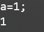
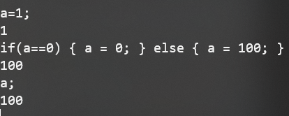
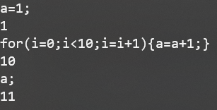
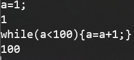

# SIJ
## 1.介绍
用Java实现的、简单直了的解释器
### 运行截图
每个语句都会输出一个数字，该数字代表着最后一次访问变量的值
1. 变量定义  

2. 表达式  

3. if循环  

4. for循环  

5. while循环  

## 2.运行
可以下载jar包直接运行，或者编译源代码运行
### I.通过Jar包 
1. 下载[jar包](https://github.com/cyy5358/SIJ/releases/download/1/SIJ.jar)
    ```bash
    curl https://github.com/cyy5358/SIJ/releases/download/1/SIJ.jar
    ```
2. 运行jar包
    ```bash
    java -jar SIJ.jar
    ```
### II.编译代码
1. 编译src/文件夹下所有的.java代码文件
    ```bash
    # Linux
    find -name "*.java" > sources.txt
    javac @source.txt -d out
    # Windows
    dir /s /B *.java > sources.txt
    javac @source.txt -d out
    ```
2. 运行
    ```bash
    java -classpath out com.compilerExp.CLI
    ```
